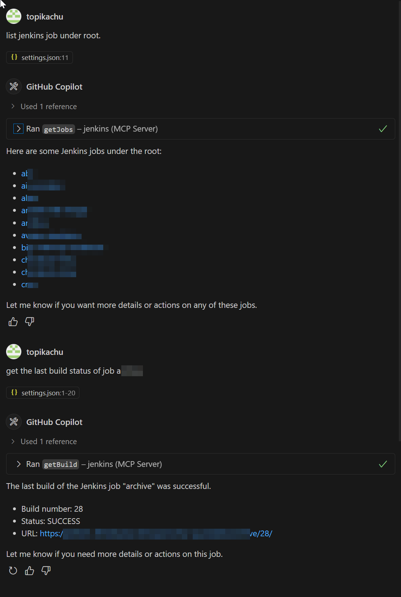

# MCP Server Plugin for Jenkins
The MCP (Model Context Protocol) Server Plugin for Jenkins implements the server-side component of the Model Context Protocol. This plugin enables Jenkins to act as an MCP server, providing context, tools, and capabilities to MCP clients, such as LLM-powered applications or IDEs.

## Features

- **MCP Server Implementation**: Implements the server-side of the Model Context Protocol.
- **Jenkins Integration**: Exposes Jenkins functionalities as MCP tools and resources.
- **Extensible Architecture**: Allows easy extension of MCP capabilities through the `McpServerExtension` interface.

## Key Components

1. **Endpoint**: The main entry point for MCP communication, handling MCP transport connections and message routing.
2. **DefaultMcpServer**: Implements `McpServerExtension`, providing default tools for interacting with Jenkins jobs and builds.
3. **McpToolWrapper**: Wraps Java methods as MCP tools, handling parameter parsing and result formatting.
4. **McpServerExtension**: Interface for extending MCP server capabilities.

## MCP SDK Version

This MCP Server is based on the MCP Java SDK version 0.17.2, which implements the MCP specification version 2025-06-18.

## Getting Started

### Prerequisites

- Jenkins (version 2.533 or higher)

### Configuration

The MCP Server plugin automatically sets up necessary endpoints and tools upon installation, requiring no additional configuration.

#### System properties

The following system properties can be used to configure the MCP Server plugin:

- hard limit on max number of log lines to return with `io.jenkins.plugins.mcp.server.extensions.BuildLogsExtension.limit.max=10000` (default 10000)
- disable stateless endpoint with `io.jenkins.plugins.mcp.server.Endpoint.disableMcpStateless=true` (default false)
- disable SSE endpoint with `io.jenkins.plugins.mcp.server.Endpoint.disableMcpSse=true` (default false)
- disable streamable HTTP endpoint with `io.jenkins.plugins.mcp.server.Endpoint.disableMcpStreamable=true` (default false)

#### Origin header validation

The MCP specification mark as `MUST` validate the `Origin` header of incoming requests. 
By default, the MCP Server plugin does not enforce this validation to facilitate usage by AI Agent not providing the header.
You can enable different levels of validation, if the header is available with the request you can enforce his validation using 
the system property `io.jenkins.plugins.mcp.server.Endpoint.requireOriginMatch=true`
When enforcing the validation, the header value must match the configured Jenkins root url.

If receiving the header is mandatory the system property `io.jenkins.plugins.mcp.server.Endpoint.requireOriginHeader=true`
will make it mandatory as well.

#### Jenkins Root URL Configuration

MCP tools rely on the Jenkins root URL being correctly configured. This is required for generating accurate links within tool responses and for the proper functioning of certain features (for example, origin header validation).

If the Jenkins root URL is not configured, MCP tool invocations will fail immediately with a clear error message explaining how to resolve the issue.

To configure the Jenkins root URL:

1. Navigate to **Manage Jenkins** in your Jenkins instance.
2. Go to **Configure System**.
3. Locate the **Jenkins URL** field and enter the full URL of your Jenkins instance (for example, `http://your-jenkins.example.com/`).
4. Click **Save**.


#### Transport Endpoints

The MCP Server plugin provides three transport endpoints, all enabled by default:

| Transport | Endpoint | Description |
|-----------|----------|-------------|
| **SSE** | `/mcp-server/sse` + `/mcp-server/message` | Server-Sent Events transport with session management |
| **Streamable HTTP** | `/mcp-server/mcp` | Streamable HTTP transport with session management |
| **Stateless** | `/mcp-server/stateless` | Stateless HTTP transport without session management |

Each transport can be disabled independently using system properties:

```
-Dio.jenkins.plugins.mcp.server.Endpoint.disableMcpSse=true
-Dio.jenkins.plugins.mcp.server.Endpoint.disableMcpStreamable=true
-Dio.jenkins.plugins.mcp.server.Endpoint.disableMcpStateless=true
```

##### When to use Stateless transport

The stateless endpoint (`/mcp-server/stateless`) is useful for:
- Simple deployments where session management overhead is not needed
- Environments where clients make independent requests without maintaining a persistent connection
- Testing and debugging scenarios
- Clients that don't support session-based protocols

## Usage

### Connecting to the MCP Server

MCP clients can connect to the server using:
- Streamable HTTP Endpoint: `<jenkins-url>/mcp-server/mcp`
- SSE Endpoint: `<jenkins-url>/mcp-server/sse`
- Message Endpoint: `<jenkins-url>/mcp-server/message`
- Stateless Endpoint: `<jenkins-url>/mcp-server/stateless`

### Authentication and Credentials

The MCP Server Plugin requires the same credentials as the Jenkins instance it's running on. To authenticate your MCP queries:

1. **Jenkins API Token**: Generate an API token from your Jenkins user account.
2. **Basic Authentication**: Use the API token in the HTTP Basic Authentication header.

#### Generate a personal access token
To generate a personal access token:

- Sign in to Jenkins.
- Select your user icon in the upper-right corner, and then select `Security`.
- Select `Add new token`.
- Enter a name to distinguish the token, and then select `Generate`.
- Copy the token and store it in a secure location for later use.

> [!WARNING] 
> Once you leave the page, you cannot view or copy the token again.

- Select `Done` to add the token.
- Select `Save` to save your changes.

#### Encode credentials for HTTP basic authentication

Use basic HTTP authentication with the MCP agent by encoding it with the personal access token.

To encode credentials on Linux, macOS, or Windows:

Open a terminal and run the following command, replacing `<username>` and `<token>` with your actual username and the personal access token you generated in Jenkins

- Linux or macOS
```bash
echo -n "<username>:<token>" | base64
```
- Windows (PowerShell)
```powershell
[Convert]::ToBase64String([Text.Encoding]::UTF8.GetBytes("<username>:<token>"))
```

if successful, the Base64-encoded credential is output, similar to the following:

```bash
dXNlcm5hbWU6dG9rZW4=
```

Store the encoded credential in a secure location for later use.

> [!NOTE] 
> Base64 encoding is not encryption.
> Anyone with access to the encoded string can decode it and obtain your credentials.
> Always protect the encoded credentials as if they are the original username and token.

### Example Client Configurations
#### Cline Configuration 
```json
{
  "mcpServers": {
    "jenkins": {
      "autoApprove": [
        
      ],
      "disabled": false,
      "timeout": 60,
      "type": "streamableHttp",
      "url": "https://jenkins-host/mcp-server/mcp",
      "headers": {
        "Authorization": "Basic <user:token base64>"
      }
    }
  }
}
```
#### Copilot Configuration
Copilot doesn't work well with the Streamable transport as of now, and I'm still investigating the issues. Please continue to use the SSE endpoint.
```json
{
  "mcp": {
    "servers": {
      "jenkins": {
        "type": "sse",
        "url": "https://jenkins-host/mcp-server/sse",
        "headers": {
          "Authorization": "Basic <user:token base64>"
        }
      }
    }
  }
}
```
Streamable example:
```json
{
  "servers": {
    "jenkins": {
      "type": "http",
      "url": "http://jenkins-host/mcp-server/mcp",
      "requestInit": {
        "headers": {
          "Authorization": "Basic <user:token base64>"
        }
      }
    }
  }
}
```
#### Windsurf Configuration
```json
{
  "servers": {
    "jenkins": {
      "command": "npx",
      "args": [
        "mcp-remote",
        "http://jenkins-host/mcp-server/mcp",
        "--header",
        "Authorization: Bearer ${AUTH_TOKEN}"
      ],
      "env": {
        "AUTH_TOKEN": "Basic <user:token base64>"
      }
    }
  }
}
```

#### Claude
```bash
claude mcp add jenkins http://jenkins-host/mcp-server/mcp --transport http --header "Authorization: Basic <user:token base64>"
```

#### Stateless Configuration Example
For clients that prefer stateless communication without session management:
```json
{
  "servers": {
    "jenkins": {
      "type": "http",
      "url": "http://jenkins-host/mcp-server/stateless",
      "requestInit": {
        "headers": {
          "Authorization": "Basic <user:token base64>"
        }
      }
    }
  }
}
```

#### Goose
- Click *“Add custom extension”*
- Give it a meaningful name
- In the type Dropdown, select *“Streamable HTTP”*
- Enter the endpoint URL. This should be something like `http://jenkins-host/mcp-server/mcp`
- Scroll to *“Request Headers”*
- In the empty field, type `Authorization` as the name. Then in the Value field, type `“Basic <user:token base64>”`
- Click *"Add"*
- Click *“Add Extension”*

### Available Tools

The plugin provides the following built-in tools for interacting with Jenkins:

#### Job Management
- `getJob`: Get a Jenkins job by its full path.
- `getJobs`: Get a paginated list of Jenkins jobs, sorted by name.
- `triggerBuild`: Trigger a build of a job.
  This tool supports parameterized builds. You can provide parameters as a JSON object where each key is the parameter name. For example:

  ```json
  {
    "jobFullName": "my-job",
    "parameters": {
      "BRANCH": "main",
      "DEBUG_MODE": "true"
    }
  }
  ```
  Note on Parameters:
  - **Core Jenkins Parameters**: Fully supported (String, Boolean, Choice, Text, Password, Run)
  - **Plugin Parameters**: Automatically detected and handled using reflection
  - **File Parameters**: Not supported via MCP (require file uploads)
  - **Multi-select Parameters**: Supported as arrays or lists
  - **Custom Plugin Parameters**: Automatically attempted using reflection-based detection
  - **Fallback Behavior**: Unsupported parameters fall back to default values with logging
  This tool returns a queue item if the job is successfully scheduled. You can use the returned queue item ID with the `getQueueItem` tool.

- `getQueueItem`: Get information about a queued item using its ID.
[
]()#### Build Information
- `getBuild`: Retrieve a specific build or the last build of a Jenkins job.
- `updateBuild`: Update build display name and/or description.
- `getBuildLog`: Retrieve log lines with pagination for a specific build or the last build.
- `searchBuildLog`: Search for log lines matching a pattern (string or regex) in build logs.

#### SCM Integration
- `getJobScm`: Retrieve SCM configurations of a Jenkins job.
- `getBuildScm`: Retrieve SCM configurations of a specific build.
- `getBuildChangeSets`: Retrieve change log sets of a specific build.
- `findJobsWithScmUrl`: Find jobs using a specific SCM (git) repository URL

#### Management Information
- `whoAmI`: Get information about the current user.
- `getStatus`: Checks the health and readiness status of a Jenkins instance. Use this tool to assess Jenkins instance health rather than simple up/down status.


Each tool accepts specific parameters to customize its behavior. For detailed usage instructions and parameter descriptions, refer to the API documentation or use the MCP introspection capabilities.

To use these tools, connect to the MCP server endpoint and make tool calls using your MCP client implementation.
### Enhanced Parameter Support

The MCP Server Plugin now provides comprehensive support for Jenkins parameters:

#### Supported Parameter Types

- **String Parameters**: Text input with default values
- **Boolean Parameters**: True/false values with automatic type conversion
- **Choice Parameters**: Dropdown selections with validation
- **Text Parameters**: Multi-line text input
- **Password Parameters**: Secure input with Secret handling
- **Run Parameters**: Build number references
- **Plugin Parameters**: Automatically detected and handled

#### Parameter Handling Features

- **Type Conversion**: Automatic conversion between JSON types and Jenkins parameter types
- **Validation**: Choice parameters validate input against available options
- **Fallback**: Unsupported parameters gracefully fall back to defaults
- **Reflection**: Plugin parameter types automatically detected and handled
- **Logging**: Comprehensive logging for debugging parameter issues

#### Example Usage

```json
{
  "jobFullName": "my-parameterized-job",
  "parameters": {
    "BRANCH": "main",
    "DEBUG_MODE": true,
    "ENVIRONMENT": "production",
    "FEATURES": ["feature1", "feature2"],
    "NOTES": "Build triggered via MCP"
  }
}
```

### Extending MCP Capabilities

To add new MCP tools or functionalities:

1. Create a class implementing `McpServerExtension`.
2. Use `@Tool` to expose methods as MCP tools.
3. Use `@ToolParam` to define and describe tool parameters.

Example:

```java
@Extension
public class MyCustomMcpExtension implements McpServerExtension {
	@Tool(description = "My custom tool")
	public String myCustomTool(@ToolParam(description = "Input parameter") String input) {
		// Tool implementation
	}
}
```
### Result Handling

The MCP Server Plugin handles various result types with the following approach:

- **List Results**: Each element in the list is converted to a separate text content item in the response.
- **Single Objects**: The entire object is converted into a single text content item.

For serialization to text content:

- **@ExportedBean Annotation**: If the result object is annotated with `@ExportedBean` (from `org.kohsuke.stapler.export`), Jenkins' `org.kohsuke.stapler.export.Flavor.JSON` exporting mechanism is used.
- **Other Objects**: For objects without the `@ExportedBean` annotation, Jackson is used for JSON serialization.

This approach ensures flexible and efficient handling of different result types, accommodating both Jenkins-specific exported objects and standard Java objects.
This flexible approach ensures that tool results are consistently and accurately represented in the MCP response, regardless of their complexity.
### Integration with GitHub Copilot
The MCP Server Plugin seamlessly integrates with GitHub Copilot, enhancing your development experience by providing direct access to Jenkins information within your IDE. This integration allows you to interact with Jenkins jobs and builds using natural language queries.


As shown in the screenshot:
1. You can ask Copilot about Jenkins jobs using natural language, e.g., "list jenkins job under root".
2. Copilot uses the MCP Server to fetch and display information about Jenkins jobs, listing the jobs under the root directory.
3. You can also request specific information, such as "get the last build status of job a", and Copilot will provide the relevant details including build number, status, and URL.

This integration streamlines your workflow by allowing you to access Jenkins information without leaving your development environment.
### Further Information
For more details on the Model Context Protocol and its Java SDK:
- [MCP Introduction](https://modelcontextprotocol.io/introduction)
- [MCP Java SDK Server Component](https://modelcontextprotocol.io/sdk/java/mcp-server)

### Contributing
Contributions to the MCP Server plugin are welcome. Please refer to the [Jenkins contribution guidelines](https://github.com/jenkinsci/.github/blob/master/CONTRIBUTING.md) for more information.
### License
This project is licensed under the MIT License - see the [LICENSE](LICENSE.md) file for details.
